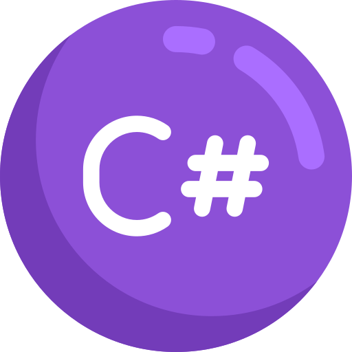
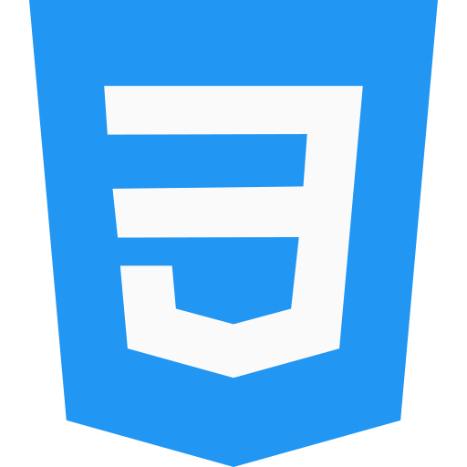

### ⚛️ Greetings everyone, I'm Nikola! ⚛️

## I'm studing to become a professional Software Engineer

- 🌱 In my free time I am always googling and learning new stuff about programming.
- 👯 I like to participate in teamwork projects, but I also enjoy to write code on my own.
- 👩🏻‍💻 Extremely keen on mastering new technologies
- 🚀 Projects I am very proud of: https://github.com/GNA-projects
- 🏅🎓View my certifications at: https://github.com/NikolaHadzhiev/Certificates
- ⚡ Fun fact: I am very beneficial when we talk about self-study. I have a great concentration and patience.

---

### C# Skills

I have gained all my knowedge thanks to the program called IT-career powered by SoftUni.

- IT-career is a three year-long national program, consisting of 12 modules and one final matriculation exam.

- During education, I was taught the programming essentials, object-oriented programming, data bases, algorithms, embedded and operating systems, functional programming, internet programming and general software development.

- I mainly worked with .NET Framework Console Applications, ASP.NET Core Applications and MySQL but also TinkerCad (C++) and Haskell.

- The program was powered by the Technology School Electronic Systems (TUES), Software University (SoftUni) and the Ministry of Education.

- During a two week internship at the company Haemimont , I worked on a demo REST API about giving specific shape files with longitude, latitude and colors to a map and visualising it. I learned the main concepts of the database PostgreSQL and the platform QGIS, Postman, DBeaver. My main contributions were at the back-end side with the language C# and the technology ASP.Net.Core.

- In present day I still use and master C#, mainly in REST APIs - latest project: https://github.com/NikolaHadzhiev/TechHeaven-Ecommerce/tree/main/API
---

### JavaScript Skills

Personally, I love developing front-end applications with ReactJS because it offers a powerful and efficient way to build dynamic and responsive user interfaces, enabling a seamless and enjoyable user experience.
SoftUni is the university that gave me knowledge about software development, equipping me with the skills and expertise needed for a successful career in the tech industry.

- During JS Web Developer Modules, I was taught to develop data-driven web applications with Node.js, Express.js, MongoDB.
- The modules provided knowledge and practical skills for the development of Single Page Applications (SPA) using ReactJS technology,custom hooks, Context API and SaSS
- Driven by my ambition to learn and grow, I took the initiative to self-teach and master the intricacies of ReactJS coupled with Redux Toolkit, a decision that has not only enhanced my skill set but has also empowered me to create sophisticated and efficient web applications.

---

### Knowledge 

The best part about knowledge is that it can aways be extended!

I have great understanding of: 
 - HTML, CSS, SaSS
 - ReactJS with Redux
 - Node.js (Express.js)
 - I can build Asp.Net.Core applications with C#
 - SQL, MySQL, PostgreSQL, MongoDB
 - MVC, MVVM, MVP architecture patterns
 - I can work with Razor Pages
 - Client-server side connections
 - REST APIs 
 - Backend-Frontend integration
 - OOP (Object Oriented Programming) based programs
 - OOP (Object Oriented Programming) concepts 
 - Complex algorithms and data structures
 - SOLID Principles
 - HTTP requests, HTTP responses, TCP, UDP
 - Security, Authentication, Authorization
---

### Connect with me:

[][gmail]
[][facebook]
[][instagram]
[][linkedin]
 

---

### Languages and Technologies I know:

 

---
[facebook]: https://www.facebook.com/profile.php?id=100006187568698
[instagram]: https://www.instagram.com/nikito.hadzhievv/
[gmail]: nikihad2012@gmail.com
[linkedin]: https://www.linkedin.com/in/nikola-hadzhiev-66879921a/
